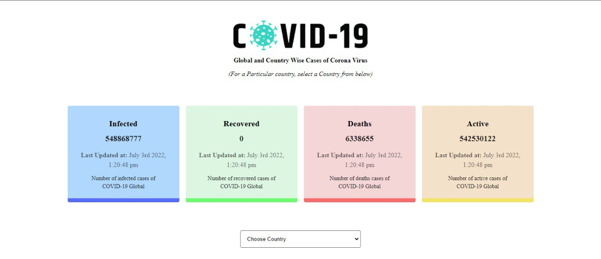
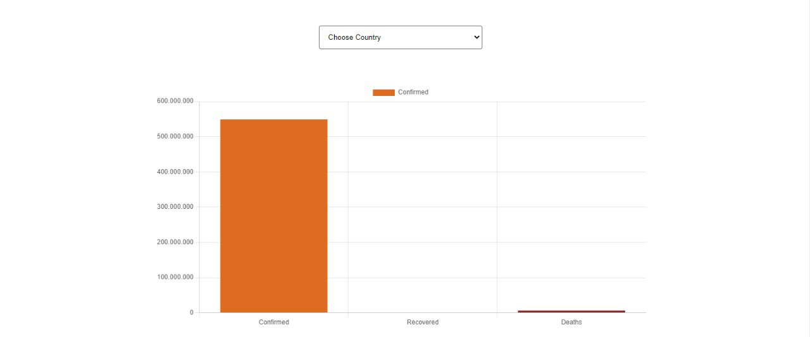

# React COVID-19 Tracker

[Live](https://patika-redux-covid-19-tracker.vercel.app/)


##  Available Scripts

```
npm install 
```
```
npm start
```

## Dependencies

- React.js
- Redux
- Redux Toolkit
- Momentjs
- Chartjs
- Stitches





## API
- https://covid19.mathdro.id/api
- https://github.com/mathdroid/covid-19-api
# Patika 

### Gereksinimler: 
- Enfekte olan, iyileşen, ölen ve aktif hasta sayısını ekrana yerleştireceğiniz dört kart ile göstermeniz gerekiyor. Ayrıca bu kartlarda son güncellenme tarihlerini de gösterebilirsiniz.
- Başlangıçta tüm dünya genelindeki veriler gösterilmelidir.
- Kartların hemen altına yerleştireceğiniz bir dropdown içerisinde ülkeleri listelemeniz gerekiyor. Buradan seçilen herhangi ülkenin detay bilgileri görüntülenebilmelidir.
- Sayfanın altına yerleştireceğiniz bölümde ise verileri grafik olarak göstermeniz gerekiyor.
